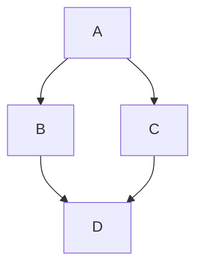
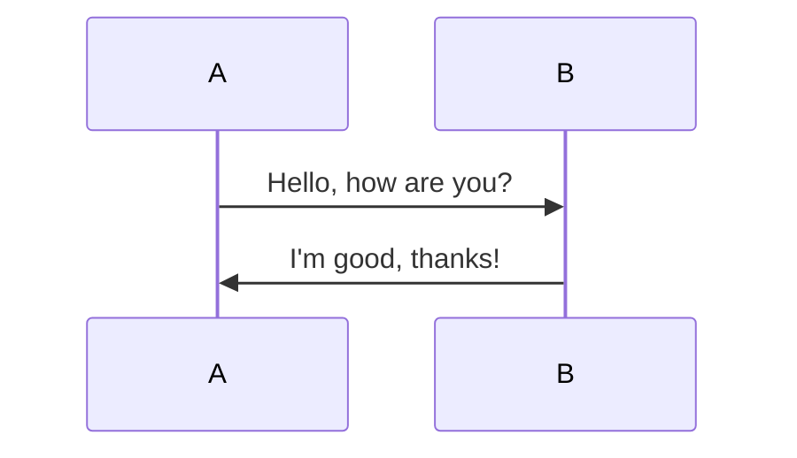
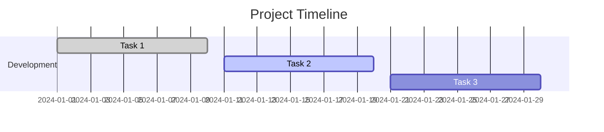

***

title: "Markdown Syntax Showcase"
description: "A comprehensive example of Markdown syntax supported by mdast."
author: "Mayank Chaudhari"
date: "2025-03-03"
categories: \[Markdown, Syntax, Documentation]
tags: \[mdast, markdown, reference]
-----------------------------------

# Markdown Syntax Showcase

## Table of Contents

* [Basic Elements](#1-basic-elements)

  * [Headings](#headings)

  * [Text Formatting](#text-formatting)

  * [Blockquote](#blockquote)

  * [Horizontal Rule](#horizontal-rule)

* [Lists](#2-lists)

  * [Unordered List](#unordered-list)

  * [Ordered List](#ordered-list)

* [Code Blocks](#3-code-blocks)

* [Tables](#4-tables)

* [Links and Images](#5-links-and-images)

* [Task Lists](#6-task-lists-gfm)

* [Footnotes](#7-footnotes)

* [Emoji](#8-emoji-gfm)

* [Math Equations](#9-math-equations-katex--latex)

* [Diagrams](#10-diagrams-mermaid)

* [Definition Lists](#11-definition-lists)

* [Admonitions](#12-admonitions-callouts)

* [HTML Elements](#13-html-elements)

* [Custom Directives](#14-custom-directives-mdx)

## 1. Basic Elements

### Headings

Different levels of headings for structuring content.

# Heading 1

The largest heading, usually reserved for the main title of the document.

## Heading 2

A subheading, used to separate major sections.

### Heading 3

A smaller heading, often used for subsections.

#### Heading 4

A more detailed subsection heading.

##### Heading 5

A minor heading, used for further breakdown.

###### Heading 6

The smallest heading, typically used for fine details.

> #### Nested Blockquote Example
>
> > ##### Nested Blockquote Level 2
> >
> > * List inside a blockquote:
> >
> >   * **Bold Text** inside a list
> >
> >   * `Inline Code` inside a list
> >
> > ```javascript
> > console.log("Code inside a blockquote list");
> > ```

### Text Formatting

* **Bold text** **`with code`**

* _Italic text_

* ~~Strikethrough~~

* `Inline code`

### Blockquote

> This is a **nested blockquote** example.
>
> > Another level of nesting.
> >
> > * List item 1
> >
> > * List item 2
> >
> >   * Subitem inside blockquote
> >
> > ```python
> > def nested_function():
> >     return "Code inside nested blockquote"
> > ```

### Horizontal Rule

***

## 2. Lists

### Unordered List

* Item 1

* Item 2

  * Subitem 1

  * Subitem 2

* Item 3

### Ordered List

1. First item
2. Second item

   1. Subitem 1
   2. Subitem 2
3. Third item

## 3. Code Blocks

### JavaScript Example

```javascript
function greet(name) {
  console.log(`Hello, ${name}!`);
}
greet("Mayank");
```

### Python Example

```python
def greet(name):
    print(f"Hello, {name}!")

greet("Mayank")
```

### Rust Example

```rust
fn greet(name: &str) -> String {
    format!("Hello, {}!", name)
}

fn main() {
    println!("{}", greet("World"));
}
```

### TypeScript Example

```typescript
interface User {
  name: string;
  age: number;
  email?: string;
}

async function fetchUser(id: string): Promise<User> {
  const response = await fetch(`/api/users/${id}`);
  return response.json();
}
```

## 4. Tables

Structuring data in tabular format.

| Name  | Age | Location      |
| ----- | --- | ------------- |
| John  | 25  | New York      |
| Alice | 30  | San Francisco |
| Bob   | 28  | London        |

### Table with md alignments

| Left-aligned | Center-aligned | Right-aligned |
| :----------- | :------------: | ------------: |
| Text 1       |     Text 2     |        Text 3 |

## 5. Links and Images

Adding hyperlinks and images.

### External Links

[OpenAI](https://openai.com)

### Internal Links

[Back to Table of Contents](#table-of-contents)

### Images

Embedding images in Markdown.

SVG:


Data URL:


### Reference Links

This is an example of using reference-style links in Markdown.

You can define a reference link like this\
[OpenAI](https://openai.com "OpenAI Website") is an AI research and deployment company.

Markdown syntax is explained in detail on [Markdown Guide](https://www.markdownguide.org "Markdown Guide").

## 6. Task Lists (GFM)

Checkable task lists.

* [x] Task 1 - Completed

* [ ] Task 2 - Pending

* [ ] Task 3 - Pending
  * [x] Subtask 3.1 - Done

  * [ ] Subtask 3.2 - Pending

* [x] Task 6 - Approved

## 7. Footnotes

Referencing additional information.

Here is a statement with a footnote.[^1]

[^1]: This is the footnote content.

## 8. Emoji (GFM)

Using emojis in Markdown.

:smile: :rocket: :tada: :fire: :computer: :heart: :rocket: :book:

## 9. Math Equations (KaTeX / LaTeX)

Displaying mathematical expressions.

Inline equation: $E=mc^2$

Block equation:

$$
\sum_{n=1}^{\infty} \frac{1}{n^2} = \frac{\pi^2}{6}
$$

### Common Math Symbols

* Greek letters: $\alpha$, $\beta$, $\gamma$, $\Gamma$, $\Delta$, $\pi$

* Fractions: $\frac{1}{2}$, $\frac{x+y}{z}$

* Square roots: $\sqrt{x}$, $\sqrt[3]{y}$

* Summations: $\sum_{i=1}^n i$, $\prod_{j=1}^m j$

* Integrals: $\int_a^b f(x) dx$

* Limits: $\lim_{x \to \infty} \frac{1}{x}$

* Matrices: $\begin{pmatrix} a & b \\ c & d \end{pmatrix}$

### Alignments

$$
\begin{aligned}
(a+b)^2 &= (a+b)(a+b) \\
&= a^2 + ab + ba + b^2 \\
&= a^2 + 2ab + b^2
\end{aligned}
$$

### Case Statements

$$
f(x) =
\begin{cases}
1, & \text{if } x > 0 \\
0, & \text{if } x = 0 \\
-1, & \text{if } x < 0
\end{cases}
$$

## 10. Diagrams (Mermaid)

Visualizing data with diagrams.

### Flowchart



### Sequence Diagram



### Gantt Chart



## 11. Definition Lists

Defining terms and meanings.

Term 1
: Definition 1

Term 2
: Definition 2a
: Definition 2b

## 12. Admonitions (Callouts)

> **Note:** This is an important note.
>
> **Warning:** Be careful with this step!

## 13. HTML Elements

### 13.1. Inline HTML

This is an example of <em>inline HTML</em> inside a paragraph:

This is a <span style="color: red; font-weight: bold;">red bold text</span> inside a Markdown paragraph.

### 13.2. Block HTML Elements

<pre>
Inside pre tag
Indentation and formatting etc. here should be preserved.
</pre>

#### Tables with HTML

<table border="1">
  <tr>
    <th>Name</th>
    <th>Age</th>
  </tr>
  <tr>
    <td>John</td>
    <td align="center">25</td>
  </tr>
  <tr>
    <td>Alice</td>
    <td>30</td>
  </tr>
</table>

### 13.3. Combining Markdown and HTML

> This is a **blockquote** with an embedded **HTML table**:
>
> <table border="1">
>   <tr>
>     <th>Feature</th>
>     <th>Supported</th>
>   </tr>
>   <tr>
>     <td>Markdown</td>
>     <td>✅</td>
>   </tr>
>   <tr>
>     <td>HTML</td>
>     <td>✅</td>
>   </tr>
> </table>

***

This document covers most of the syntax supported by Markdown, including extended features such as GFM, math, diagrams, and HTML components.
