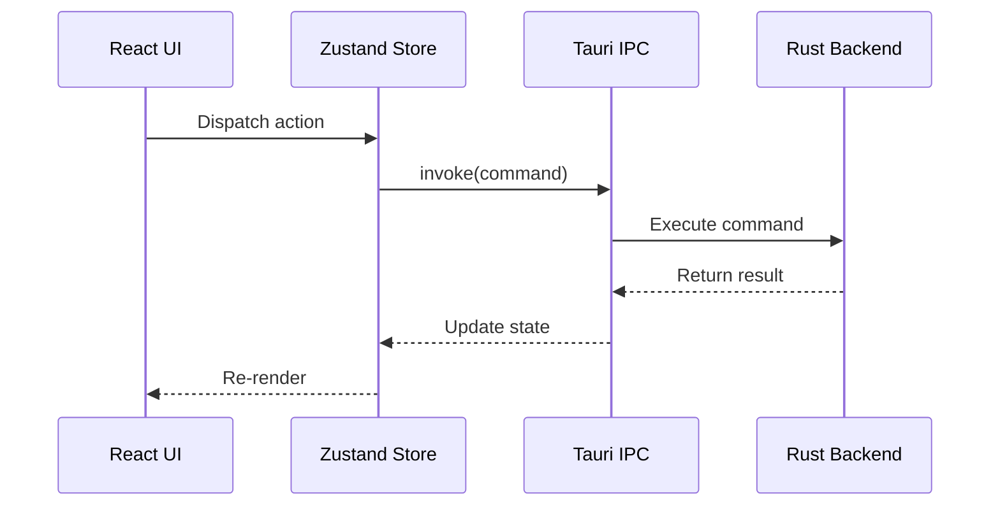

# Project Documentation

## Overview

This is a sample project documentation demonstrating Markdown's capabilities for technical writing.

## Getting Started

### Prerequisites

Before you begin, ensure you have the following installed:

- **Node.js** >= 18.0.0
- **npm** >= 9.0.0 or **yarn** >= 1.22.0
- **Git** >= 2.30.0

### Installation

```bash
# Clone the repository
git clone https://github.com/example/project.git

# Navigate to the project directory
cd project

# Install dependencies
npm install

# Start the development server
npm run dev
```

### Project Structure

```
project/
├── src/
│   ├── components/     # React components
│   │   ├── ui/         # Base UI primitives
│   │   ├── editor/     # Editor components
│   │   └── sidebar/    # Sidebar components
│   ├── hooks/          # Custom React hooks
│   ├── stores/         # State management
│   └── lib/            # Utilities
├── public/             # Static assets
└── package.json
```

## Architecture

### System Design

The application follows a **layered architecture**:

| Layer | Technology | Responsibility |
|-------|-----------|----------------|
| Presentation | React 19 | UI rendering |
| State | Zustand | Global state |
| IPC | Tauri v2 | Bridge to backend |
| Backend | Rust | File system, search |

### Data Flow



## API Reference

### File System API

#### `readFile(path)`

Reads a file from the local filesystem.

**Parameters:**

| Name | Type | Required | Description |
|------|------|----------|-------------|
| path | `string` | Yes | Absolute path to the file |

**Returns:** `Promise<string>` - File contents

**Example:**

```typescript
const content = await invoke("read_file", { path: "/path/to/file.md" });
```

#### `writeFile(path, content)`

Writes content to a file.

**Parameters:**

| Name | Type | Required | Description |
|------|------|----------|-------------|
| path | `string` | Yes | Absolute path to the file |
| content | `string` | Yes | Content to write |

### Search API

#### `searchFiles(query)`

Searches indexed files by content.

```typescript
const results = await invoke("search_files", { query: "keyword" });
// Returns: Array<{ path: string, title: string, snippet: string, score: number }>
```

## Configuration

### Editor Settings

```json
{
  "theme": "dark",
  "fontSize": 16,
  "lineHeight": 1.75,
  "autoSave": true,
  "autoSaveDelay": 1000,
  "tabSize": 2
}
```

### Keyboard Shortcuts

| Shortcut | Action |
|----------|--------|
| `Ctrl+P` | Search files |
| `Ctrl+Shift+P` | Command palette |
| `Ctrl+B` | Toggle sidebar |
| `Ctrl+S` | Save file |

## Deployment

### Build for Production

```bash
# Build the frontend
npm run build

# Build the Tauri application
npm run tauri build
```

### Supported Platforms

- **Windows** 10/11 (x86_64)
- **macOS** 12+ (x86_64, arm64)
- **Linux** (x86_64, requires WebKit2GTK)

## Contributing

### Code Style

This project follows these conventions:

1. **TypeScript** strict mode enabled
2. **ESLint** with @typescript-eslint rules
3. **Prettier** for formatting
4. **Conventional Commits** for git messages

### Pull Request Process

1. Fork the repository
2. Create a feature branch (`git checkout -b feature/amazing-feature`)
3. Commit your changes (`git commit -m 'feat: add amazing feature'`)
4. Push to the branch (`git push origin feature/amazing-feature`)
5. Open a Pull Request

## License

This project is licensed under the MIT License - see the [LICENSE](LICENSE) file for details.

---

> **Note:** This is a sample documentation file for testing Markdown rendering.
>
> **Tip:** Use `Ctrl+Shift+P` to open the command palette.
